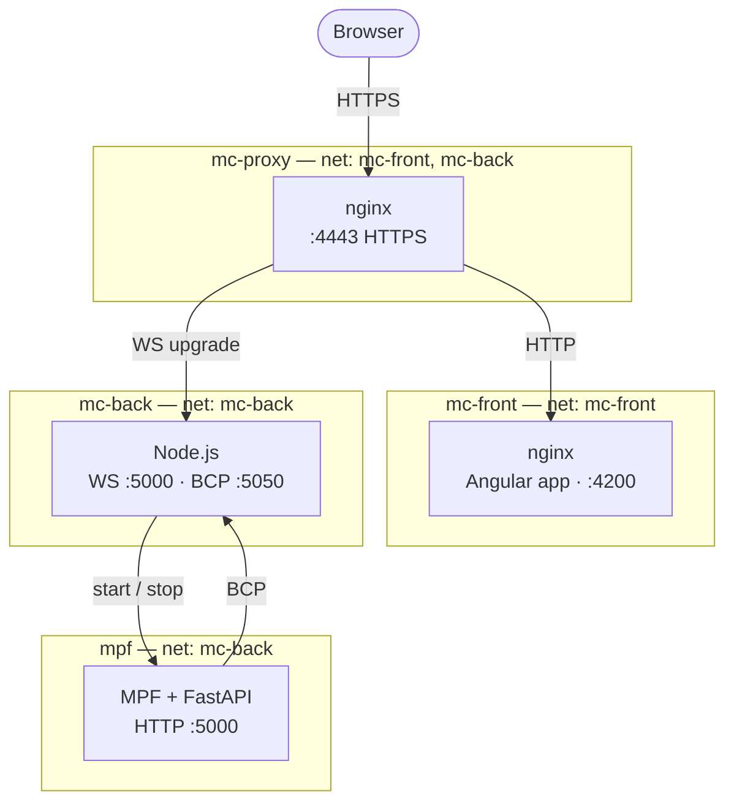
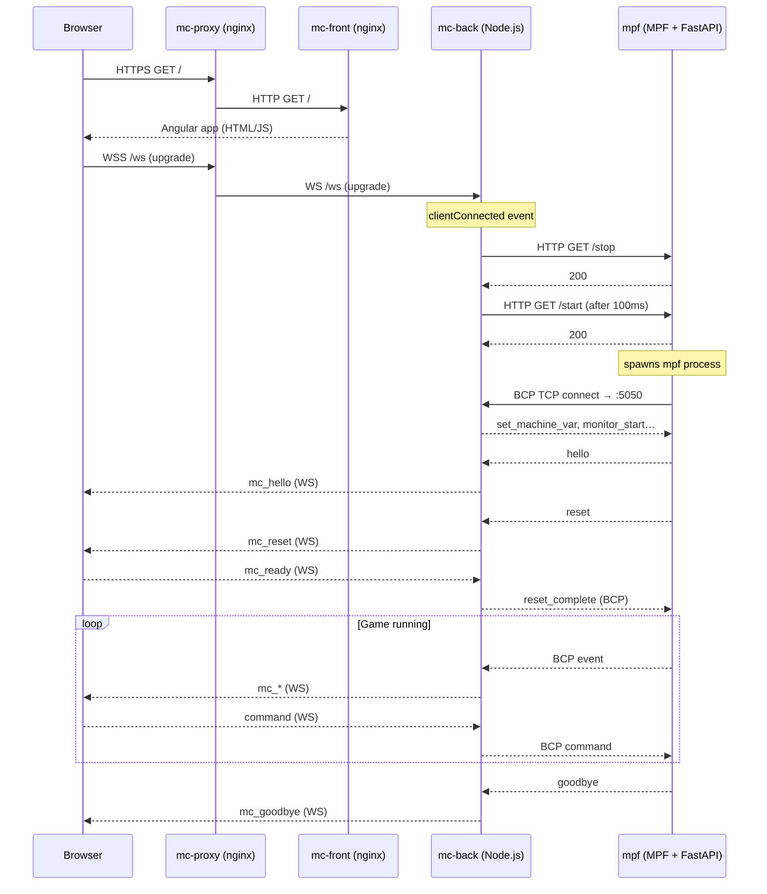
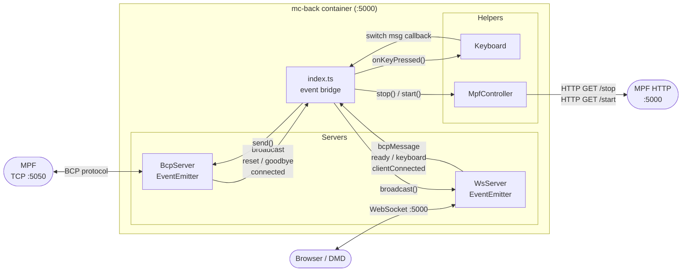
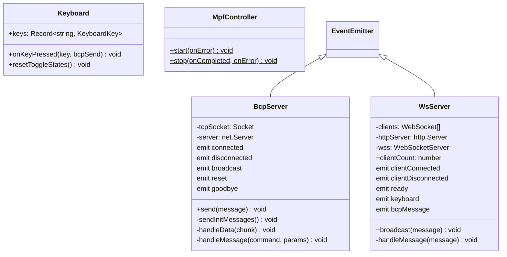

# Architecture

## Container topology

> `mc-proxy` is on both networks (`mc-front` and `mc-back`). `mc-front` and `mc-back` are fully isolated from each other.

## Request flow

## mc-back internal design

### mc-back class diagram

